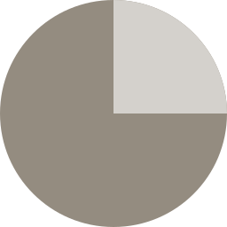

<div align="center">



# Clawdot

**The mobile-first IDE for agentic coding**<br>
Build, test, and ship software from your phone — the agent runs on your own machine


</div>

---

Clawdot lets you build, test, and ship software from your phone — powered by an AI coding agent running on your own machine. No cloud sandboxes, no server costs, no compromises. Your computer does the work; Clawdot is the cockpit.

## The Problem

Agentic coding tools like Claude Code are powerful, but they're built for the desktop. On a phone, you can watch an agent work — but you can't *verify* anything. There's no browser to open your web app, no way to hit your API endpoints, no feedback loop. Mobile "vibe coding" today means blindly trusting the agent and checking the results later at your desk.

## The Idea

Clawdot closes that loop with two core concepts:

### 1. Your machine, remotely

A lightweight CLI daemon runs on your computer (or home server) and hosts **terminal sessions**: real PTYs running the coding agents you already use (`claude`, `codex`, …) full-screen, exactly like in your desktop terminal. Your phone connects through an end-to-end encrypted tunnel — paired once via QR code. The relay server only forwards ciphertext; it never sees your code, your prompts, or your keys. Since all compute happens on hardware you already own — and the agent CLIs reuse the subscriptions you're already logged into — there are effectively zero running costs beyond what you already pay.

### 2. Generative test surfaces

This is what makes Clawdot different. The agent doesn't just write code — it builds the interface you need to verify it:

- **Building a web app?** The daemon tunnels the dev server and the app renders a live preview right inside the IDE — with a real mobile viewport on your phone.
- **Building a backend?** Instead of a useless browser tab, the agent assembles an interactive test panel from declarative building blocks: forms, buttons, and response viewers wired directly to the endpoints it just created. A purpose-built mini API client, generated on the fly.

Interactions flow back into the loop: press a test button, the request fails, the error lands in the agent's context, the agent fixes it. That's the feedback cycle mobile coding has been missing.

## Architecture

Clawdot is a pnpm monorepo with a protocol-first design — clients are just renderers, so new surfaces (desktop app, VS Code fork) plug into the same backbone later.

```
apps/
  web/        → React + Vite web app — the IDE UI, plus the Tauri 2 mobile shell (src-tauri/)
  cli/        → Node.js daemon — hosts terminal sessions (PTYs), manages workspaces and pairing
  relay/      → self-hostable ciphertext-only WebSocket forwarder (one bundled file on a VPS)
packages/
  protocol/   → shared message schemas (Zod), E2E tunnel crypto, protocol versioning
```

**Message flow:** The protocol separates `terminal.*` messages (PTY lifecycle, keystrokes, raw output) from `surface.*` events (things the client should render — web previews, test panels). Adding a new widget type never requires touching the transport layer.

**Terminal sessions are daemon-scoped.** Locking your phone drops the socket — and on mobile, it will constantly — so the agent process lives on the daemon, not the connection. The daemon feeds every PTY through a headless terminal; when you reattach (same phone or a different device), you get a serialized snapshot of the current screen plus scrollback and the live stream continues, with the agent never noticing you were gone.

**Remote access is end-to-end encrypted.** The daemon dials out to the relay (no port forwarding), each phone is a multiplexed channel on that socket, and every channel runs an X25519 handshake + ChaCha20-Poly1305 framing the relay cannot open. `clawdot pair` prints a QR code; scanning it opens the hosted web app with a one-time ticket in the URL fragment, and from then on the device's own key is the credential. The relay (plus the hosted web app) deploys as one container from the root `Dockerfile` — route your domain to container port 9700 and let the fronting proxy do TLS.

**Previews get their own origin (recommended setup: one extra DNS record).** Add `preview.clawdot.example.com` next to `clawdot.example.com` — an ordinary A record to the same server and an ordinary HTTPS domain entry in your proxy (a normal Let's Encrypt certificate works; no wildcard cert, no DNS-provider API). Previews then render at `https://preview.clawdot.example.com/`, where the previewed app sees its real URL paths — client-side routers, `pushState` navigation and SSR hydration all work unmodified — and gets browser storage separate from the IDE. (Wildcard alternative: `*.clawdot.example.com` serves each port at `p5173.…` with per-port storage isolation, but Let's Encrypt only issues wildcard certificates via DNS-API challenges — only worth it if you already have that.) Without any preview record, everything still works in compatibility mode (`/preview/<port>/` on the app origin), which path-sensitive apps may dislike. Either way the daemon keeps previewed apps' login sessions in an in-memory cookie jar (the tunnel can't deliver cookies to the phone's browser), so cookie-auth apps stay signed in across reconnects — nothing is ever written to disk.

## Install

Install the CLI from npm:

```sh
npm install -g clawdot     # puts `clawdot` on PATH

clawdot                    # interactive menu — first run opens the setup wizard

# Everything is also a direct subcommand for scripting:
clawdot setup              # guided configuration (relay, port, background service)
clawdot service install    # run the daemon in the background — starts at login via
                           # launchd (macOS), a systemd user unit (Linux), or the
                           # Startup folder (Windows)
clawdot pair               # QR-pair a phone through the relay
clawdot devices            # list / revoke paired devices
clawdot config             # change settings later
clawdot serve              # …or run the daemon in the foreground instead
```

There is no default relay: you point the daemon at the one *you* host (the
root `Dockerfile`) and it sticks — via the wizard or `clawdot --relay <url>`.
Nothing in clawdot phones home anywhere you didn't configure.

## Mobile app

On a phone you can just open the hosted web app in the browser — it's the
full IDE and pairs with your daemon through the relay exactly as above.

The web frontend is also designed to be wrapped as a native app via a
Tauri 2 shell. That shell is **not committed** to this repository, because
it carries personal signing config (Apple Team ID, bundle identifier) and a
project-specific Firebase `GoogleService-Info.plist` for push. To build your
own, generate a fresh shell against `apps/web` with your own identifiers:

```sh
cd apps/web
pnpm tauri init          # scaffold src-tauri/ with your own bundle id
pnpm tauri ios init      # generate the iOS project (needs Rust + Xcode)
pnpm tauri ios dev       # build + run on a simulator
```

Building for a real device needs your own Apple signing team
(`bundle > iOS > developmentTeam` in `src-tauri/tauri.conf.json`), and push
notifications need your own Firebase project. The relay's FCM integration is
configured entirely from the environment (see the `Dockerfile`); no
credentials ship in this repo.

## Roadmap

- [x] Monorepo scaffold: web, cli, protocol packages
- [x] Protocol: message envelope, terminal/workspace/settings schemas, E2E tunnel crypto + pairing handshake
- [x] CLI daemon: persistent terminal sessions (PTYs) for any agent CLI, workspace tracking, relay connection + QR pairing
- [x] Relay server: minimal ciphertext-only WebSocket forwarder (self-hostable)
- [x] Web app: terminal session list, full-screen xterm.js views, reattach with scrollback replay
- [x] Port proxy + embedded web preview (preview panel: HTTP + WebSocket forwarding through the E2E tunnel via a service worker)
- [x] Multi-port apps + CORS escape hatch: cross-origin localhost calls from a preview tunnel automatically; an allowlist in settings routes chosen external hosts through your machine (sidesteps localhost-pinned CORS, reaches private-network hosts)
- [x] Cookie sessions in previews: a daemon-side in-memory cookie jar keeps previewed apps logged in (Better Auth & co.) — the browser can't hold tunnel cookies, so the daemon does
- [x] Own-origin previews: one `preview.` DNS record (ordinary certificate — recommended) or wildcard `p<port>.` subdomains give previews real URL paths (client routers, pushState, SSR hydration just work) and browser storage separate from the IDE; automatic fallback to `/preview/<port>/` where neither exists (Tauri shell, no DNS record)
- [ ] Generative test surfaces: declarative widget schema, API test panels
- [x] Native mobile app shell (Tauri 2 wrapper around the web app; iOS project generated, Android pending an SDK install)
- [ ] Desktop / VS Code integration

## Philosophy

- **Own your compute.** Your code runs on your hardware. The relay is a dumb, self-hostable pipe.
- **Protocol over platform.** Every client speaks the same schema-validated protocol. The UI is replaceable; the backbone isn't.
- **Verification is the product.** An agent that codes without letting you test is a demo. Clawdot makes the test loop first-class — especially on the device you always have with you.

## Status

🚧 Early development. Working today: the daemon runs persistent terminal sessions for any agent CLI (`claude`, `codex`, a plain shell — the list is editable in the app); the web app drives them full-screen via xterm.js and reattaches with a scrollback replay after a disconnect — locally or from anywhere through the self-hosted relay with QR pairing and end-to-end encryption. The first surface is in: a web preview panel that renders a dev server running on the daemon's machine, with all HTTP and WebSocket traffic (Vite HMR included) forwarded through the same encrypted connection.

## License

[MIT](./LICENSE)
